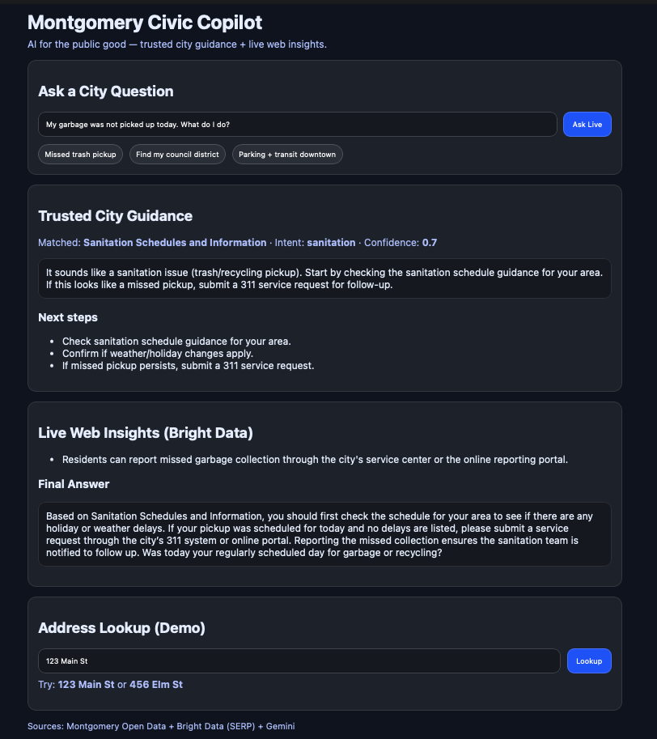

<!--
Montgomery Civic Copilot — README
Tip: After you push to GitHub, replace the banner image link with a raw GitHub URL if you want it to render on the repo page.
-->

<p align="center">
  <a href="https://www.linkedin.com/in/mohammed10vir">
    
  </a>
  
  
</p>

<p align="center">
  
  
  
  
  
  
  
  
  
  
</p>

<p align="center">
  
</p>

# Montgomery Civic Copilot 🏛️🤖
**AI for the public good — trusted city guidance + live web insights.**

Montgomery Civic Copilot helps residents quickly find the right City of Montgomery service (sanitation, 311/service requests, districts, mobility) and get clear next steps. It blends:
- **Montgomery Open Data (curated MVP pack)** for trusted routing and actions
- **Bright Data SERP** for real-time web intelligence (bonus points)
- **Gemini API** to summarize and rewrite answers into clear, action-first guidance
- **Fallback rules + caching** so demos never break

---

## Quickstart (2–3 minutes)

- **Live Demo:** https://gen-lang-client-0570326286.web.app  
- **API Base:** https://mcc-backend-900370650328.us-central1.run.app

### What this is
A resident-facing assistant that routes questions to the right Montgomery civic service and returns **trusted next steps**, enhanced with **Bright Data live insights** and polished by **Gemini**, while staying reliable via fallback rules.

### What to try (fast demo)
1) **Ask Live**
- Question: **“My garbage was not picked up today. What do I do?”**
- You should see:
  - **Trusted City Guidance**
  - **Live Web Insights (Bright Data)**
  - **Final Answer (Gemini rewrite)**
  - `live_mode` = `brightdata+gemini` when live enrichment succeeds (otherwise `fallback`)

2) **Address Lookup (demo)**
- Try: `123 Main St` (or `456 Elm St`)

### Why it matters (public good)
City information is often scattered across dashboards and pages. Civic Copilot reduces friction by turning trusted open data + live context into **clear actions residents can take immediately**.

---

## Demo scenarios (MVP)
1. **Missed trash pickup** → sanitation guidance + escalation path  
2. **Council / district context (demo)** → address lookup flow  
3. **Downtown mobility** → parking/transit/traffic guidance (extendable)

---

## Architecture
See: **`docs/architecture.md`**

---

## Screenshots (recommended 5)
1. `docs/screenshots/01-hero-ask-live.png` — end-to-end Ask Live result  
2. `docs/screenshots/02-ask-live-ui.png` — full UI context  
3. `docs/screenshots/03-api-ask-live-proof.png` — API proof (Bright Data + Gemini)  
4. `docs/screenshots/04-swagger-overview.png` — Swagger overview  
5. `docs/screenshots/05-api-ask-response.png` — `/ask` response (trusted + sources)

(Optional)
- `docs/screenshots/06-ask-live-ui-address-lookup.png`

---

## Tech Stack
- **Frontend:** React + Vite
- **Backend:** FastAPI (Python)
- **AI:** Google Gemini (Google AI Studio key)
- **Web intelligence:** Bright Data SERP
- **Data:** City of Montgomery Open Data (curated JSON pack for MVP speed + stability)

---

## Deployment (Live Prototype)
- **Frontend:** Firebase Hosting — https://gen-lang-client-0570326286.web.app  
- **Backend:** Google Cloud Run — https://mcc-backend-900370650328.us-central1.run.app  
- **Build/Registry:** Cloud Build + Artifact Registry (image: `mcc-backend:latest`)

## Run locally

### 1) Environment variables
Create **`.env`** in the repo root (do not commit secrets):

```env
GEMINI_API_KEY=
BRIGHTDATA_API_KEY=
BRIGHTDATA_ZONE_SERP=serp_api1
```

### 2) Backend
```bash
cd backend
python3 -m venv .venv
source .venv/bin/activate
pip install -r requirements.txt
python -m uvicorn app.main:app --port 8000
```

API docs: http://127.0.0.1:8000/docs

Operational checks:
- http://127.0.0.1:8000/health
- http://127.0.0.1:8000/instance

### 3) Frontend
```bash
cd frontend
npm install
npm run dev
```

App: http://localhost:5173

---

## API Endpoints (summary)
- `POST /ask` — trusted response (Gemini-polished, fallback-safe)
- `POST /ask-live` — trusted + Bright Data + Gemini (returns `live_mode`, `live_debug`)
- `POST /lookup-address` — demo address lookup
- `POST /enrich` — Bright Data SERP debug
- `GET /health`, `GET /instance` — operational checks

---

## Reliability by design (judge-friendly)
- **Fallback rules** ensure you always get a complete response.
- **SERP caching** stabilizes demos and reduces repeated external calls.
- **Output safety checks** prevent incomplete LLM output.
- **Transparency:** `live_mode` + `live_debug` indicate whether live enrichment ran.

---

## License
MIT (or hackathon default)

---

<p align="center">
  <a href="https://www.linkedin.com/in/mohammed10vir">
    
  </a>
</p>
