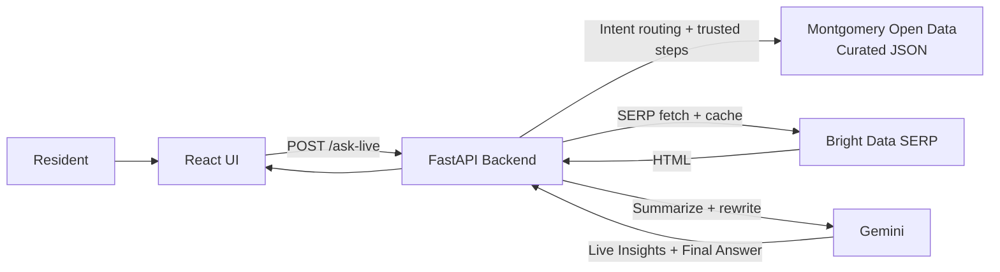

# Architecture — Montgomery Civic Copilot

Montgomery Civic Copilot is a civic assistant that combines **trusted Montgomery open-data routing** with **real-time web intelligence (Bright Data SERP)** and **Gemini** to produce clear, action-first answers — while staying **demo-safe** via fallbacks.

## Ask Live pipeline
1. **React UI** calls `POST /ask-live`.
2. **FastAPI**:
   - classifies intent → selects the correct civic record from curated Montgomery Open Data JSON
   - produces a deterministic **trusted_answer + next_steps** (always available)
3. **Bright Data SERP** fetches live context (cached for stability).
4. **Gemini**:
   - extracts 2–6 **Live Insights** bullets from SERP text
   - rewrites a **Final Answer** using trusted steps + live insights
5. **Reliability controls**:
   - `live_mode`: `brightdata+gemini` when live insights are real; otherwise `fallback`
   - `live_debug`: pipeline trace (SERP length, bullets count, final length)
   - fallbacks prevent broken demos and incomplete LLM output

## Why this scores well
- **Public good impact:** reduces friction for residents to reach the right service + next action.
- **Execution quality:** working end-to-end UI + API, structured outputs, stable demo behavior.
- **Innovation:** open data routing + Bright Data real-time intelligence + Gemini clarity layer.
- **Reliability:** transparent mode/debug + safe fallbacks (no broken demos).

## Diagram

**Primary demo endpoint:** `/ask-live`
